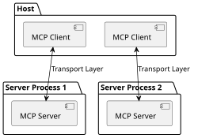

# Model Context Protocol - Wikipedia

**元URL**: https://ja.wikipedia.org/wiki/Model_Context_Protocol
**取得日**: 2026-05-27 22:59:41

---

出典: フリー百科事典『ウィキペディア（Wikipedia）』

Model Context Protocol

|  |  |
| --- | --- |
| 開発者 | [Anthropic](//ja.wikipedia.org/wiki/Anthropic "Anthropic") |
| 利用開始 | 2024年11月25日 (2024-11-25)[[1]](#cite_note-Anthropic20241125-1) |
| ウェブサイト | [modelcontextprotocol.io](https://modelcontextprotocol.io) [ウィキデータを編集](https://www.wikidata.org/wiki/Q133436854#P856 "ウィキデータを編集") |

**Model Context Protocol**（**MCP**、モデル・コンテキスト・プロトコル）は、[2024年](//ja.wikipedia.org/wiki/2024年 "2024年")11月に[Anthropic](//ja.wikipedia.org/wiki/Anthropic "Anthropic")が発表した、[生成的人工知能](//ja.wikipedia.org/wiki/生成的人工知能 "生成的人工知能")（生成AI）と他のシステムを双方向接続するための[オープン標準](//ja.wikipedia.org/wiki/オープン標準 "オープン標準")である[[1]](#cite_note-Anthropic20241125-1)。

[AIアシスタント](//ja.wikipedia.org/wiki/バーチャルアシスタント "バーチャルアシスタント")などの生成AIがデータの存在するシステムに対して接続可能にするための[プロトコル](//ja.wikipedia.org/wiki/プロトコル "プロトコル")であり、データを保有するシステムの開発者はMCPに対応することによって、MCPに対応する生成AIへそのデータへのアクセスを提供することが可能である。また生成AIの開発者とデータを保有するシステムの開発者の双方にとって、独自のコネクタを作成・維持することが不要となる[[2]](#cite_note-TheVerge20241125-2)。Anthropicと競合している[OpenAI](//ja.wikipedia.org/wiki/OpenAI "OpenAI")は[2025年](//ja.wikipedia.org/wiki/2025年 "2025年")3月に[[3]](#cite_note-TechCrunch20250326-3)、[Google DeepMind](//ja.wikipedia.org/wiki/Google_DeepMind "Google DeepMind")は同年4月に、[AWS](//ja.wikipedia.org/wiki/Amazon_Web_Services "Amazon Web Services")と[マイクロソフト](//ja.wikipedia.org/wiki/マイクロソフト "マイクロソフト")は同年5月に、MCPを自社製品へ組み込むことを発表した[[4]](#cite_note-TechCrunch20250409-4)[[5]](#cite_note-5)[[6]](#cite_note-6)。

2025年12月にはAnthropicが本プロトコルを[Linux Foundation](//ja.wikipedia.org/wiki/Linux_Foundation "Linux Foundation")傘下の「Agentic AI Foundation（AAIF）」に移管した[[7]](#cite_note-linux-foundation-7)。

## 概要

[[編集](/w/index.php?title=Model_Context_Protocol&action=edit&section=1 "節を編集: 概要")]

MCPは、AIシステムが外部のデータソースやツールと接続するための普遍的なオープン標準として設計されている。MCPが登場する以前、開発者はデータソースやツールごとに個別のカスタムコネクターを構築しなければならず、Anthropicはこれを「N×M問題」と表現した[[8]](#cite_note-anthropic-intro-8)。MCPは単一のプロトコルで多数のシステムをつなぐことにより、この断片化された統合を解消する。[言語サーバープロトコル](//ja.wikipedia.org/wiki/言語サーバープロトコル?action=edit&redlink=1 "言語サーバープロトコル (存在しないページ)")（LSP）がプログラミング言語のサポートを開発ツールのエコシステム全体で標準化したことにヒントを得た設計であり、MCPはAIアプリケーションのエコシステムにおいて外部コンテキストとツールの統合を同様に標準化する[[9]](#cite_note-mcp-spec-9)。

## 仕様

[[編集](/w/index.php?title=Model_Context_Protocol&action=edit&section=2 "節を編集: 仕様")]

MCPクライアントとサーバーとの関係性

MCPは、[Language Server Protocol](//ja.wikipedia.org/wiki/Language_Server_Protocol?action=edit&redlink=1 "Language Server Protocol (存在しないページ)")（[英語版](https://en.wikipedia.org/wiki/Language%20Server%20Protocol "en:Language Server Protocol")）（LSP）に触発された[JSON-RPC](//ja.wikipedia.org/wiki/JSON-RPC "JSON-RPC") 2.0ベースのプロトコルである。[クライアントサーバモデル](//ja.wikipedia.org/wiki/クライアントサーバモデル "クライアントサーバモデル")を採用しており、用語にはそれぞれ以下のような意味がある[[10]](#cite_note-OfficialSpecification20250326-10)。

* ホスト（Hosts） - 接続を開始するアプリケーション
* クライアント（Clients） - ホスト内に存在するコネクター
* サーバー（Servers） - データを提供するサービス

1つのクライアントごとに1つのサーバーとのコネクションが存在している。サーバーは必ずしも[インターネット](//ja.wikipedia.org/wiki/インターネット "インターネット")経由でアクセスするものではなく、ローカルに存在する場合が存在する[[11]](#cite_note-OfficialArchitecture20250326-11)。

## 実装

[[編集](/w/index.php?title=Model_Context_Protocol&action=edit&section=3 "節を編集: 実装")]

* [2024年](//ja.wikipedia.org/wiki/2024年 "2024年")[11月25日](//ja.wikipedia.org/wiki/11月25日 "11月25日") - [Anthropic](//ja.wikipedia.org/wiki/Anthropic "Anthropic")がMCPを発表し、[Claude for Desktop](//ja.wikipedia.org/wiki/Claude "Claude")での対応を表明[[1]](#cite_note-Anthropic20241125-1)。
* [2025年](//ja.wikipedia.org/wiki/2025年 "2025年")[4月7日](//ja.wikipedia.org/wiki/4月7日 "4月7日") - [GitHub](//ja.wikipedia.org/wiki/GitHub "GitHub")は[Visual Studio Code](//ja.wikipedia.org/wiki/Visual_Studio_Code "Visual Studio Code")にMCPのサポートを加え、パブリックプレビューとして公開した[[12]](#cite_note-GitHubblog20250407-12)。
* 2025年[5月19日](//ja.wikipedia.org/wiki/5月19日 "5月19日") - [Microsoft](//ja.wikipedia.org/wiki/Microsoft "Microsoft")は同社の[OS](//ja.wikipedia.org/wiki/オペレーティングシステム "オペレーティングシステム")である[Windows 11](//ja.wikipedia.org/wiki/Windows_11 "Windows 11")にMCPのサポートを追加することを発表した[[13]](#cite_note-Windowsdevblog20250519-13)[[14]](#cite_note-Forest20250521-14)。

## 脚注

[[編集](/w/index.php?title=Model_Context_Protocol&action=edit&section=4 "節を編集: 脚注")]

[[脚注の使い方](//ja.wikipedia.org/wiki/Help:脚注/読者向け "Help:脚注/読者向け")]

1. [以下の位置に戻る: 1](#cite_ref-Anthropic20241125_1-0) [2](#cite_ref-Anthropic20241125_1-1) [3](#cite_ref-Anthropic20241125_1-2) [“Introducing the Model Context Protocol”](https://www.anthropic.com/news/model-context-protocol). [Anthropic](//ja.wikipedia.org/wiki/Anthropic "Anthropic"). 2024年11月25日. 2025年5月19日時点のオリジナルより[アーカイブ](https://web.archive.org/web/20250519204803/https://www.anthropic.com/news/model-context-protocol). 2025年5月27日閲覧.
2. [↑](#cite_ref-TheVerge20241125_2-0 "元の位置に戻る") Roth, Emma (2024年11月25日). [“Anthropic launches tool to connect AI systems directly to datasets”](https://www.theverge.com/2024/11/25/24305774/anthropic-model-context-protocol-data-sources). *[The Verge](//ja.wikipedia.org/wiki/ザ・ヴァージ "ザ・ヴァージ")*. 2025年5月16日時点のオリジナルより[アーカイブ](https://web.archive.org/web/20250516060322/https://www.theverge.com/2024/11/25/24305774/anthropic-model-context-protocol-data-sources). 2025年5月16日閲覧.
3. [↑](#cite_ref-TechCrunch20250326_3-0 "元の位置に戻る") Wiggers, Kyle (2025年3月26日). [“OpenAI adopts rival Anthropic’s standard for connecting AI models to data”](https://techcrunch.com/2025/03/26/openai-adopts-rival-anthropics-standard-for-connecting-ai-models-to-data/). *[TechCrunch](//ja.wikipedia.org/wiki/TechCrunch "TechCrunch")*. 2025年5月13日時点のオリジナルより[アーカイブ](https://web.archive.org/web/20250513120448/https://techcrunch.com/2025/03/26/openai-adopts-rival-anthropics-standard-for-connecting-ai-models-to-data/). 2025年5月27日閲覧.
4. [↑](#cite_ref-TechCrunch20250409_4-0 "元の位置に戻る") Wiggers, Kyle (2025年4月9日). [“Google to embrace Anthropic’s standard for connecting AI models to data”](https://techcrunch.com/2025/04/09/google-says-itll-embrace-anthropics-standard-for-connecting-ai-models-to-data/). *[TechCrunch](//ja.wikipedia.org/wiki/TechCrunch "TechCrunch")*. 2025年5月12日時点のオリジナルより[アーカイブ](https://web.archive.org/web/20250512010016/https://techcrunch.com/2025/04/09/google-says-itll-embrace-anthropics-standard-for-connecting-ai-models-to-data/). 2025年5月27日閲覧.
5. [↑](#cite_ref-5 "元の位置に戻る") “[AWS のサーバーレスおよびコンテナサービス向けの新しい Model Context Protocol (MCP) サーバーを発表 - AWS](https://aws.amazon.com/jp/about-aws/whats-new/2025/05/new-model-context-protocol-servers-aws-serverless-containers/)”. *Amazon Web Services, Inc.*. 2025年8月10日閲覧。
6. [↑](#cite_ref-6 "元の位置に戻る") “[Microsoft、Model Context Protocolを広範囲にサポートへ ―MCPサーバーレジストリ、MCP on Windowsを提供](https://gihyo.jp/article/2025/05/microsoft-mcp)”. *gihyo.jp* (2025年5月20日). 2025年8月10日閲覧。
7. [↑](#cite_ref-linux-foundation_7-0 "元の位置に戻る") “[Linux Foundation Announces the Formation of the Agentic AI Foundation (AAIF)](https://www.linuxfoundation.org/press/linux-foundation-announces-the-formation-of-the-agentic-ai-foundation)”.  Linux Foundation (2025年12月9日). 2025年3月22日閲覧。
8. [↑](#cite_ref-anthropic-intro_8-0 "元の位置に戻る") “[Introducing the Model Context Protocol](https://www.anthropic.com/news/model-context-protocol)”.  Anthropic (2024年11月25日). 2025年3月22日閲覧。
9. [↑](#cite_ref-mcp-spec_9-0 "元の位置に戻る") “[Specification – Model Context Protocol](https://modelcontextprotocol.io/specification/2025-11-25)”.  Model Context Protocol (2025年11月25日). 2025年3月22日閲覧。
10. [↑](#cite_ref-OfficialSpecification20250326_10-0 "元の位置に戻る") [“Specification”](https://modelcontextprotocol.io/specification/2025-03-26). *Modal Context Protocol*. 2025年3月26日. 2025年5月17日時点のオリジナルより[アーカイブ](https://web.archive.org/web/20250517135034/https://modelcontextprotocol.io/specification/2025-03-26). 2025年5月27日閲覧.
11. [↑](#cite_ref-OfficialArchitecture20250326_11-0 "元の位置に戻る") [“Architecture”](https://modelcontextprotocol.io/specification/2025-03-26/architecture). *Modal Context Protocol*. 2025年3月26日. 2025年4月21日時点のオリジナルより[アーカイブ](https://web.archive.org/web/20250421153202/https://modelcontextprotocol.io/specification/2025-03-26/architecture). 2025年5月27日閲覧.
12. [↑](#cite_ref-GitHubblog20250407_12-0 "元の位置に戻る") Dohmke, Thomas (2025年4月7日). [“Vibe coding with GitHub Copilot: Agent mode and MCP support rolling out to all VS Code users”](https://github.blog/news-insights/product-news/github-copilot-agent-mode-activated/). *The GitHub Blog*. [GitHub](//ja.wikipedia.org/wiki/GitHub "GitHub"). 2025年5月15日時点のオリジナルより[アーカイブ](https://web.archive.org/web/20250515141530/https://github.blog/news-insights/product-news/github-copilot-agent-mode-activated/). 2025年5月27日閲覧.
13. [↑](#cite_ref-Windowsdevblog20250519_13-0 "元の位置に戻る") Davuluri, Pavan (2025年5月19日). [“Advancing Windows for AI development: New platform capabilities and tools introduced at Build 2025”](https://blogs.windows.com/windowsdeveloper/2025/05/19/advancing-windows-for-ai-development-new-platform-capabilities-and-tools-introduced-at-build-2025/). *Windows Developer Blog*. [Microsoft](//ja.wikipedia.org/wiki/Microsoft "Microsoft"). 2025年5月26日時点のオリジナルより[アーカイブ](https://web.archive.org/web/20250526224641/https://blogs.windows.com/windowsdeveloper/2025/05/19/advancing-windows-for-ai-development-new-platform-capabilities-and-tools-introduced-at-build-2025/). 2025年5月27日閲覧.
14. [↑](#cite_ref-Forest20250521_14-0 "元の位置に戻る") 樽井秀人「[AIがWindows機能・データを活用できる ～Windows 11で「MCP」がネイティブサポートへ](https://archive.today/wQh6u)」『[窓の杜](//ja.wikipedia.org/wiki/窓の杜 "窓の杜")』2025年5月21日。[オリジナル](https://forest.watch.impress.co.jp/docs/news/2015926.html)の2025年5月27日時点におけるアーカイブ。2025年5月27日閲覧。

## 関連項目

[[編集](/w/index.php?title=Model_Context_Protocol&action=edit&section=5 "節を編集: 関連項目")]

ウィキメディア・コモンズには、**[Model Context Protocol](https://commons.wikimedia.org/wiki/Category:Model_Context_Protocol?uselang=ja)**に関連するカテゴリがあります。

* [アプリケーションプログラミングインタフェース](//ja.wikipedia.org/wiki/アプリケーションプログラミングインタフェース "アプリケーションプログラミングインタフェース") - ソフトウェアコンポーネント間で情報を交換するためのインターフェース
* [Agent2Agent](//ja.wikipedia.org/wiki/Agent2Agent?action=edit&redlink=1 "Agent2Agent (存在しないページ)")（[wikidata](https://www.wikidata.org/wiki/Q133867455 "wikidata:Q133867455")） - Googleが発表したAIエージェント同士の通信プロトコル

## 外部リンク

[[編集](/w/index.php?title=Model_Context_Protocol&action=edit&section=6 "節を編集: 外部リンク")]

* [公式ウェブサイト](https://modelcontextprotocol.io)
* [Modelcontextprotocol](https://github.com/modelcontextprotocol) - [GitHub](//ja.wikipedia.org/wiki/GitHub "GitHub")
  * [servers](https://github.com/modelcontextprotocol/servers) - [GitHub](//ja.wikipedia.org/wiki/GitHub "GitHub")
* [モデルコンテキストプロトコル（MCP）](https://docs.anthropic.com/ja/docs/agents-and-tools/mcp) - Anthropic

「<https://ja.wikipedia.org/w/index.php?title=Model_Context_Protocol&oldid=108925289>」から取得

[カテゴリ](/wiki/%E7%89%B9%E5%88%A5:%E3%82%AB%E3%83%86%E3%82%B4%E3%83%AA "特別:カテゴリ"):

* [アプリケーション層プロトコル](/wiki/Category:%E3%82%A2%E3%83%97%E3%83%AA%E3%82%B1%E3%83%BC%E3%82%B7%E3%83%A7%E3%83%B3%E5%B1%A4%E3%83%97%E3%83%AD%E3%83%88%E3%82%B3%E3%83%AB "Category:アプリケーション層プロトコル")
* [マルチエージェントシステム](/wiki/Category:%E3%83%9E%E3%83%AB%E3%83%81%E3%82%A8%E3%83%BC%E3%82%B8%E3%82%A7%E3%83%B3%E3%83%88%E3%82%B7%E3%82%B9%E3%83%86%E3%83%A0 "Category:マルチエージェントシステム")
* [大規模言語モデル](/wiki/Category:%E5%A4%A7%E8%A6%8F%E6%A8%A1%E8%A8%80%E8%AA%9E%E3%83%A2%E3%83%87%E3%83%AB "Category:大規模言語モデル")
* [Anthropic](/wiki/Category:Anthropic "Category:Anthropic")